<div align="center">

<br>

```
 ███╗   ██╗ ██████╗ ██╗   ██╗ █████╗ ███████╗██╗  ██╗██╗   ██╗██╗     ██████╗
 ████╗  ██║██╔═══██╗██║   ██║██╔══██╗██╔════╝██║  ██║╚██╗ ██╔╝██║     ██╔══██╗
 ██╔██╗ ██║██║   ██║██║   ██║███████║███████╗███████║ ╚████╔╝ ██║     ██║  ██║
 ██║╚██╗██║██║   ██║╚██╗ ██╔╝██╔══██║╚════██║██╔══██║  ╚██╔╝  ██║     ██║  ██║
 ██║ ╚████║╚██████╔╝ ╚████╔╝ ██║  ██║███████║██║  ██║   ██║   ███████╗██████╔╝
 ╚═╝  ╚═══╝ ╚═════╝   ╚═══╝  ╚═╝  ╚═╝╚══════╝╚═╝  ╚═╝   ╚═╝   ╚══════╝╚═════╝
```

```
████████╗███████╗░█████╗░██╗░░██╗███╗░░██╗░█████╗░██╗░░░░░░█████╗░░██████╗░██╗███████╗░██████╗
╚══██╔══╝██╔════╝██╔══██╗██║░░██║████╗░██║██╔══██╗██║░░░░░██╔══██╗██╔════╝░██║██╔════╝██╔════╝
░░░██║░░░█████╗░░██║░░╚═╝███████║██╔██╗██║██║░░██║██║░░░░░██║░░██║██║░░██╗░██║█████╗░░╚█████╗░
░░░██║░░░██╔══╝░░██║░░██╗██╔══██║██║╚████║██║░░██║██║░░░░░██║░░██║██║░░╚██╗██║██╔══╝░░░╚═══██╗
░░░██║░░░███████╗╚█████╔╝██║░░██║██║░╚███║╚█████╔╝███████╗╚█████╔╝╚██████╔╝██║███████╗██████╔╝
░░░╚═╝░░░╚══════╝░╚════╝░╚═╝░░╚═╝╚═╝░░╚══╝░╚════╝░╚══════╝░╚════╝░░╚═════╝░╚═╝╚══════╝╚═════╝░**
```

<br>

---

### Network Security Internship Program
#### Task 1 — Foundation & Lab Setup

**Mohammed Saifuddin** &nbsp;|&nbsp; April 24, 2026 &nbsp;|&nbsp; NovaShyld Technologies

---

<br>


</div>

<br>
<br>

## Overview

This repository contains the complete documentation and evidence for **Task 1** of the NovaShyld Technologies Network Security Internship Program. Task 1 establishes the theoretical and practical foundation required for all subsequent penetration testing and network security work throughout the program.

The task is divided into three modules, each building on the last — from conceptual security principles, to building a fully isolated virtual hacking lab, to mastering the Linux operating system that powers all security tooling.

<br>

---

## Table of Contents

- [Module 1 — Security Fundamentals](#module-1--security-fundamentals)
- [Module 2 — Lab Environment Creation](#module-2--lab-environment-creation)
- [Module 3 — Linux Essentials](#module-3--linux-essentials)
- [Screenshots](#screenshots)
- [Tools Used](#tools-used)
- [Security & Ethics Statement](#security--ethics-statement)

---

<br>

## Module 1 — Security Fundamentals

> *Theoretical grounding in core cybersecurity principles before any practical work begins.*

<br>

### The CIA Triad

The CIA Model is the cornerstone of all information security. Every control, policy, and system is designed to address one or more of its three pillars.

| Pillar | Definition | Key Mechanisms | Primary Threats |
|---|---|---|---|
| **Confidentiality** | Sensitive information is accessible only to authorized parties | Encryption (AES, RSA), ACLs, RBAC, MFA | Data leakage, eavesdropping, MitM attacks |
| **Integrity** | Data cannot be altered by unauthorized parties | SHA-256 hashing, digital signatures, audit logs | SQL injection, tampering, unauthorized modification |
| **Availability** | Systems and services are accessible when needed | Redundancy, DRP, BCP, failover systems | DoS/DDoS, ransomware, hardware failure |

<br>

### Cyber Threat Categories

```
THREAT LANDSCAPE
├── Malware
│   ├── Viruses — self-replicating, attach to legitimate files
│   ├── Worms — self-spreading via network vulnerabilities
│   ├── Trojans — disguised as legitimate software
│   ├── Ransomware — encrypts files, demands payment
│   ├── Spyware — silent data collection
│   └── Rootkits — hidden privileged access
│
├── Phishing & Social Engineering
│   ├── Email Phishing — mass credential harvesting
│   ├── Spear Phishing — targeted, personalised attacks
│   ├── Whaling — targeting executives
│   ├── Vishing / Smishing — voice and SMS variants
│   └── Pharming — DNS-level URL redirection
│
├── Denial of Service
│   ├── DoS — single-source volumetric flood
│   ├── DDoS — botnet-amplified traffic
│   ├── SYN Flood — TCP connection exhaustion
│   └── Layer 7 — application-layer HTTP floods
│
└── Credential Attacks
    ├── Brute Force — exhaustive password enumeration
    ├── Dictionary Attack — wordlist-based guessing
    ├── Credential Stuffing — leaked credential reuse
    ├── Pass-the-Hash — relay captured auth hashes
    └── Hash Cracking — offline rainbow table attacks
```

<br>

### Common Attack Surfaces

**Email** — Phishing, spoofing, malicious attachments, Business Email Compromise (BEC). Mitigated through SPF, DKIM, DMARC, filtering, and awareness training.

**Web Applications** — SQL injection, XSS, CSRF, IDOR, broken authentication (OWASP Top 10). Mitigated through input validation, WAFs, HTTPS, and secure coding practices.

**Wireless Networks** — Evil Twin attacks, WEP/WPA cracking, deauthentication, packet sniffing, Bluetooth exploits. Mitigated through WPA3, VPN, disabled WPS, MAC filtering.

**The Human Factor** — Pretexting, baiting, tailgating, quid pro quo, impersonation. Mitigated through zero-trust culture, strict verification, and security awareness training.

<br>

### Ethical Hacking Framework

```
PHASES OF ETHICAL HACKING
─────────────────────────────────────────────────────────────
  1. Reconnaissance   →  OSINT, DNS, WHOIS enumeration
  2. Scanning         →  Live hosts, open ports, services
  3. Gaining Access   →  Vulnerability exploitation
  4. Maintaining Access →  Simulated persistence
  5. Covering Tracks  →  Log analysis (documented in testing)
  6. Reporting        →  Risk-rated findings & remediation
─────────────────────────────────────────────────────────────
```

> **Legal Requirement:** Written authorisation is mandatory before any testing. Unauthorised access constitutes a criminal offence under the CFAA (USA), Computer Misuse Act (UK), and IT Act 2000 (India).

**Relevant Certifications:** CEH, OSCP, CompTIA Security+, PenTest+, GPEN

---

<br>

## Module 2 — Lab Environment Creation

> *Building a fully isolated virtual penetration testing lab using industry-standard tooling.*

<br>

### Lab Architecture

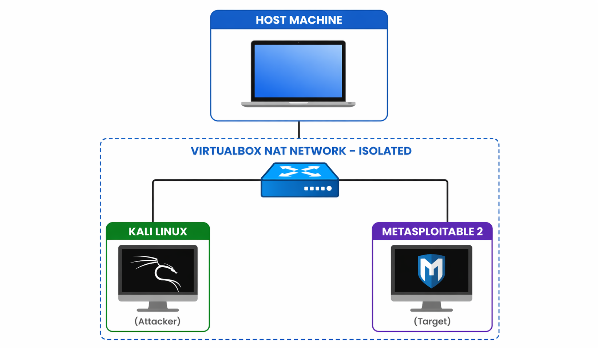

Both machines communicate exclusively over the private VirtualBox NAT Network (`10.0.2.0/24`). No traffic reaches the host network or internet, ensuring a fully contained and ethical lab environment. DHCP automatically assigns IPs to both machines within the configured subnet.

<br>

### Tools & Software

| Tool | Version | Purpose |
|---|---|---|
| Oracle VirtualBox | Latest | Hypervisor — hosts both virtual machines |
| Kali Linux | Latest ISO | Attacker machine — industry-standard penetration testing OS |
| Metasploitable 2 | v2.0 | Target machine — intentionally vulnerable for safe practice |

<br>

### Step-by-Step Setup Process

**Step 1 — Download & Install Oracle VirtualBox**
Downloaded from the official Oracle website and installed with default settings. VirtualBox serves as the hypervisor hosting both virtual machines throughout the internship.

**Step 2 — Download & Install Kali Linux**
Kali Linux ISO was downloaded from the official Kali website. A new virtual machine was created in VirtualBox and the ISO was mounted to perform a fresh OS installation.

**Step 3 — Download & Deploy Metasploitable 2**
Metasploitable 2 was obtained as a pre-built `.vmdk` image from SourceForge. It was imported into VirtualBox without requiring OS installation — the image arrives pre-configured with dozens of intentional vulnerabilities for training purposes.

**Step 4 — Configure NAT Network**
A dedicated NAT Network (`NatNetwork`) was created under VirtualBox > File > Tools > Network Manager with the following configuration:
- Network CIDR: `10.0.2.0/24`
- DHCP: Enabled

**Step 5 — Attach Both VMs to the NAT Network**
Network adapters for both machines were updated from default NAT to the custom NAT Network, placing both on the same isolated subnet:
- Kali Linux: `Settings > Network > Adapter 1 > NAT Network`
- Metasploitable 2: `Settings > Network > Adapter 1 > NAT Network`

**Step 6 — Verify IP Addresses**
```bash
ifconfig
```
Executed on Kali Linux to confirm DHCP assignment on the `10.0.2.x` subnet.

**Step 7 — Test Connectivity**
```bash
ping <Metasploitable2-IP>
```
Successful ICMP replies confirmed stable communication between attacker and target. Lab verified as fully operational.

<br>

### Lab Setup Screenshots

<br>

**Oracle VirtualBox Download**

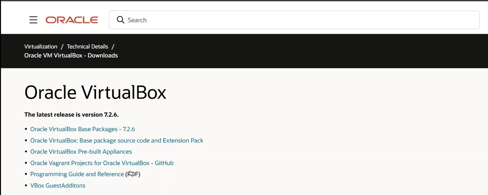

<br>

**Kali Linux Download**

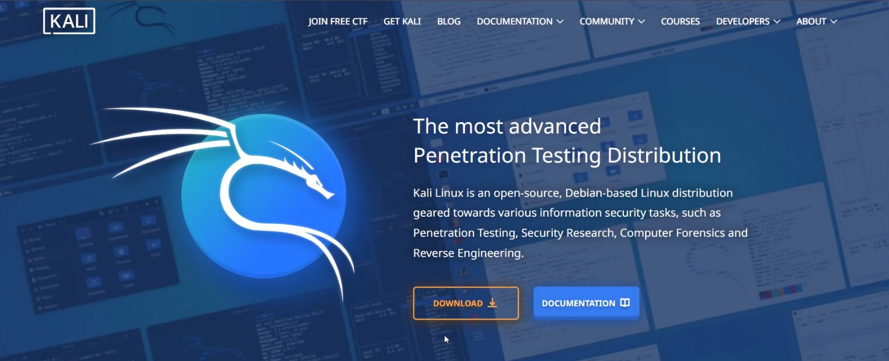

<br>

**Metasploitable 2 Download**

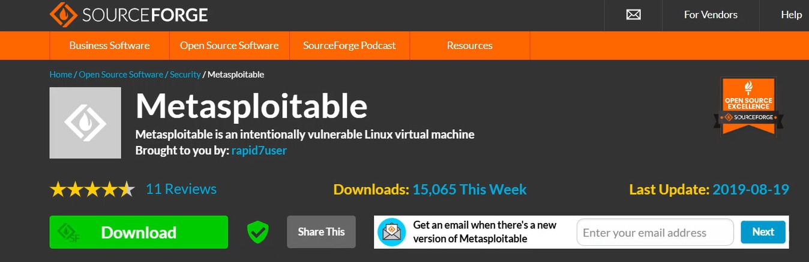

<br>

**NAT Network Configuration**

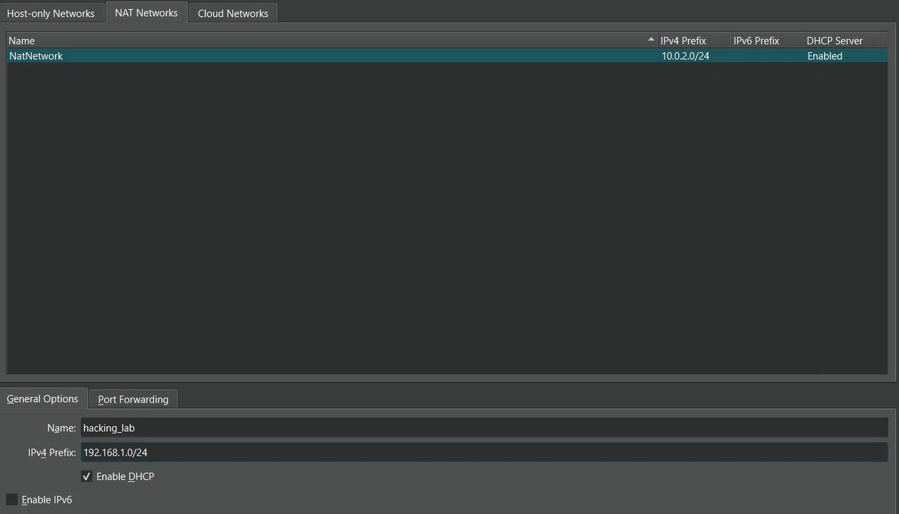

<br>

**Network Settings — VirtualBox**

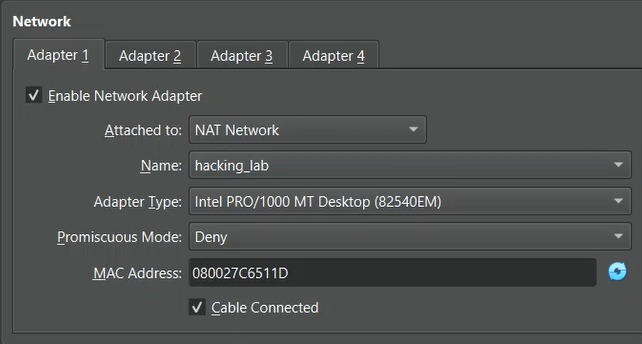

<br>

**IP Address Verification (ifconfig)**

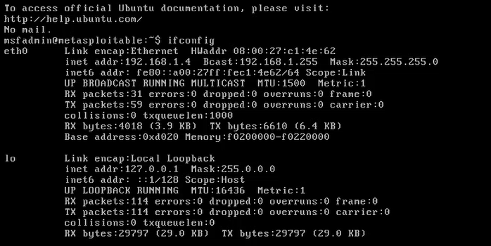

<br>

**Kali Linux Pinging Target**

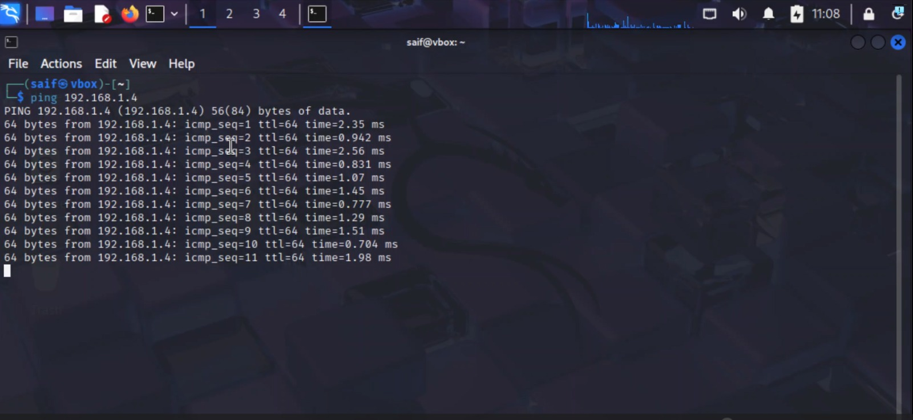

---

<br>

## Module 3 — Linux Essentials

> *Mastering the terminal, file system, permissions, package management, and networking commands in Kali Linux.*

<br>

### Terminal Navigation

**Linux Filesystem Hierarchy**

| Directory | Purpose |
|---|---|
| `/` | Root of the entire filesystem |
| `/home` | User home directories (e.g., `/home/kali`) |
| `/bin` `/sbin` | System binaries and core commands |
| `/etc` | System and application configuration files |
| `/tmp` | Temporary files, cleared on reboot |
| `/var` | Variable data: logs, databases, mail |
| `/proc` | Virtual filesystem for running processes |
| `/dev` | Device files representing hardware |

**Navigation Commands**

```bash
pwd                         # Print current working directory
ls                          # List directory contents
ls -la                      # List all files with detailed permissions
cd /path                    # Change to specified directory
cd ~                        # Navigate to home directory
cd ..                       # Move one directory up
cd -                        # Return to previous directory
find / -name file.txt       # Search for file by name from root
history                     # Show previously executed commands
```

**File & Directory Operations**

```bash
touch file.txt              # Create an empty file
mkdir dirname               # Create a new directory
mkdir -p a/b/c              # Create nested directories
cp src dest                 # Copy a file
mv src dest                 # Move or rename a file
rm file.txt                 # Delete a file
rm -rf dirname              # Recursively delete directory (use with caution)
cat file.txt                # Display file contents
grep 'text' file            # Search for pattern inside a file
```

<br>

### Terminal Navigation Screenshots

<br>

**pwd — Print Working Directory**

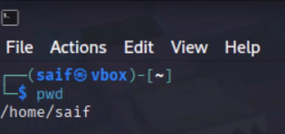

<br>

**cd — Change Directory**

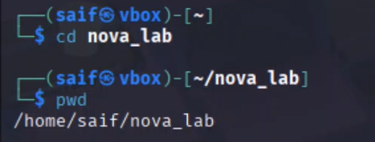

<br>

**ls — List Directory Contents**

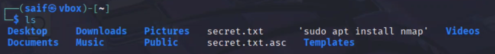

<br>

**mkdir — Create New Directory**

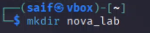

<br>

**touch — Create New File**

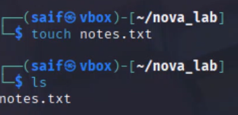

<br>

### File Permissions & Ownership

**Reading the Permission String**

```
-rwxr-xr--  1  kali  kali  4096  Apr 24  file.sh
 ─┬─ ─┬─ ─┬─
  │   │   └── Others: r-- (read only)
  │   └────── Group:  r-x (read + execute)
  └────────── Owner:  rwx (full access)
```

**Octal Permission Values**

| Permission | Symbol | Value |
|---|---|---|
| Read | `r` | 4 |
| Write | `w` | 2 |
| Execute | `x` | 1 |
| None | `-` | 0 |

**Common Combinations:** `777` (full access), `755` (owner full, others read/execute), `644` (owner rw, others read), `600` (owner only — SSH keys)

**chmod & chown Commands**

```bash
chmod 755 file.sh           # Set rwxr-xr-x via octal
chmod +x file.sh            # Add execute permission for all
chmod u-w file.txt          # Remove write from owner
chmod -R 644 /dir           # Recursively apply permissions
chown user file             # Change file owner
chown user:group file       # Change owner and group
ls -l file                  # View current permissions
stat file                   # Detailed metadata including permissions
```

<br>

**chmod — Modifying File Permissions**

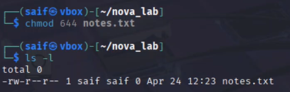

<br>

### Package Management

**APT Package Manager**

```bash
sudo apt update             # Refresh package repository list
sudo apt upgrade            # Upgrade all installed packages
sudo apt install <pkg>      # Install a specific package
sudo apt install -y <pkg>   # Install without confirmation prompt
sudo apt remove <pkg>       # Remove package (keeps config files)
sudo apt purge <pkg>        # Remove package and config files
sudo apt autoremove         # Remove unused dependencies
sudo apt search <term>      # Search for packages by keyword
sudo apt show <pkg>         # Show detailed package information
sudo apt list --installed   # List all installed packages
```

**Service Management**

```bash
sudo systemctl start <service>    # Start a service
sudo systemctl stop <service>     # Stop a running service
sudo systemctl restart <service>  # Restart a service
sudo systemctl status <service>   # Check service status
sudo systemctl enable <service>   # Auto-start on boot
```

<br>

**sudo apt update — Refreshing Package List**

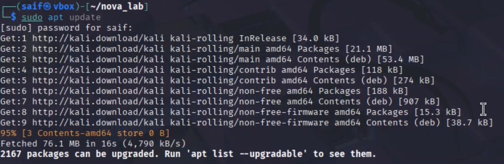

<br>

**sudo apt install — Installing a Package**

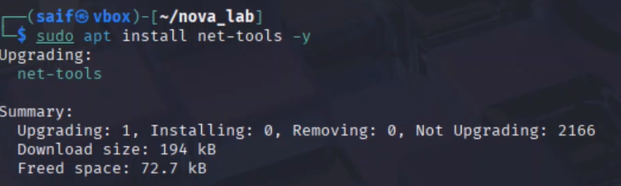

<br>

### Networking Commands

**Network Interface & IP Configuration**

```bash
ifconfig                            # Show all interfaces and IPs
ip a                                # Alternative to ifconfig
ip link show                        # Display interface status
ip route                            # Show routing table
hostname -I                         # Display system IP address(es)
cat /etc/resolv.conf                # View configured DNS servers
```

**Connectivity Testing**

```bash
ping <host>                         # Test ICMP connectivity
ping -c 4 192.168.1.1               # Send exactly 4 echo requests
traceroute <host>                   # Trace packet route to destination
mtr <host>                          # Real-time ping + traceroute
curl -I http://site.com             # Fetch HTTP headers
wget http://site.com/file           # Download a file
telnet <host> <port>                # Test raw TCP connectivity
```

<br>

**ifconfig — Viewing Network Interface**


<br>

**ping — Testing Network Connectivity**

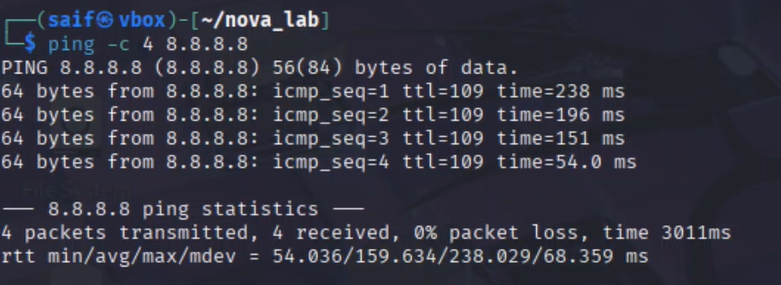

---

<br>

## Screenshots

A full reference of all screenshots included in this repository, named according to the demonstrated command or action:

### Lab Setup (Module 2)

| File | Description |
|---|---|
| `Network_Topology_Diagram.png` | Lab architecture — Host, NAT Network, Kali Linux (Attacker), Metasploitable 2 (Target) |
| `oracle-download.png` | Oracle VirtualBox download from official site |
| `kali-linux-download.png` | Kali Linux ISO download |
| `metasploitable2-download.png` | Metasploitable 2 image download |
| `nat-network-setup.png` | NAT Network configuration in VirtualBox |
| `network-setting.png` | VM network adapter settings |
| `ifconfig.png` | IP address verification on Kali Linux |
| `kali-pinging-target.png` | Successful ping from Kali to Metasploitable 2 |

### Linux Commands (Module 3)

| File | Description |
|---|---|
| `cd.png` | Navigating directories with `cd` |
| `chmod.png` | Modifying file permissions with `chmod` |
| `ifconfig.png` | Checking network interfaces |
| `ls.png` | Listing directory contents |
| `mkdir.png` | Creating a new directory |
| `ping.png` | Sending ICMP packets to test connectivity |
| `pwd.png` | Printing the current working directory |
| `sudo-apt-update.png` | Running a system package update |
| `sudo-install.png` | Installing a package via `apt install` |
| `touch.png` | Creating a new file with `touch` |

---

<br>

## Tools Used

| Tool | Purpose |
|---|---|
| Oracle VirtualBox | Virtualisation platform |
| Kali Linux | Penetration testing OS (attacker machine) |
| Metasploitable 2 | Intentionally vulnerable target machine |
| Bash / Zsh | Shell environment for all command execution |
| APT | Package manager for software installation |
| net-tools | Provides `ifconfig` and related utilities |

---

<br>

## Security & Ethics Statement

All work documented in this repository was conducted exclusively within an isolated virtual lab environment. No real-world systems, networks, or devices were targeted at any point.

- All activities took place within the VirtualBox NAT Network (`10.0.2.0/24`), fully separated from the host machine and internet.
- Metasploitable 2 is a machine designed specifically for educational security practice and was never exposed to external networks.
- Kali Linux tools were operated solely within the confines of this controlled lab in accordance with NovaShyld Technologies internship guidelines.
- All practical work aligns with the ethical hacking principles and legal boundaries covered in Module 1 — specifically the requirement for explicit scope, written authorisation, and confined testing environments.

---

<br>

<div align="center">

**NovaShyld Technologies — Network Security Internship**

Mohammed Saifuddin &nbsp;·&nbsp; Task 1 &nbsp;·&nbsp; April 2026


</div>
